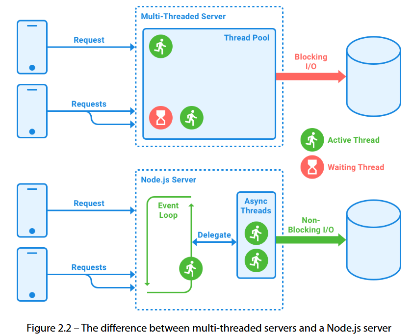
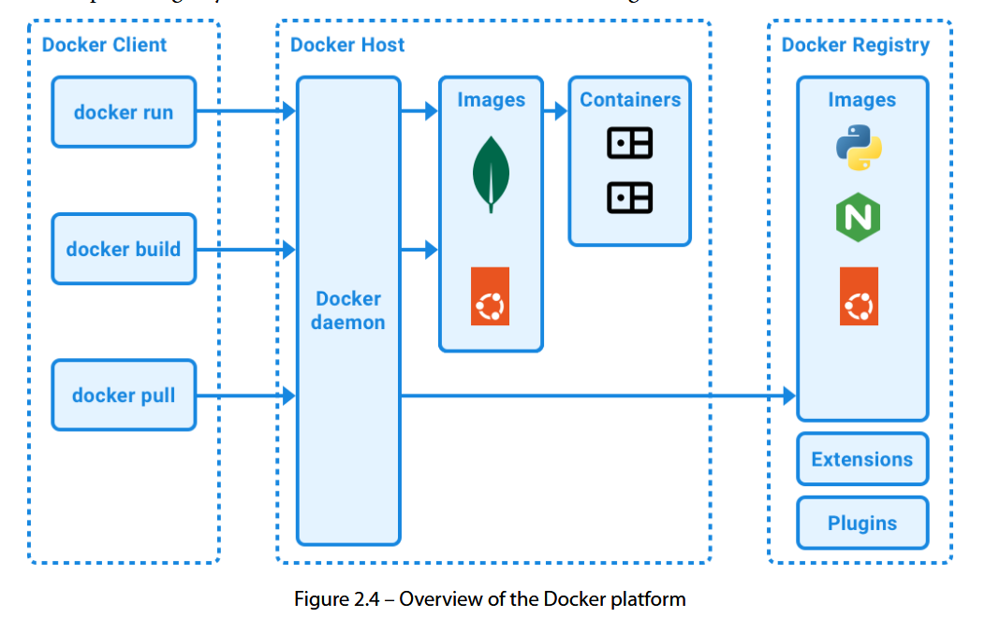
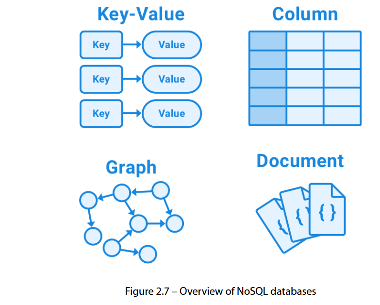
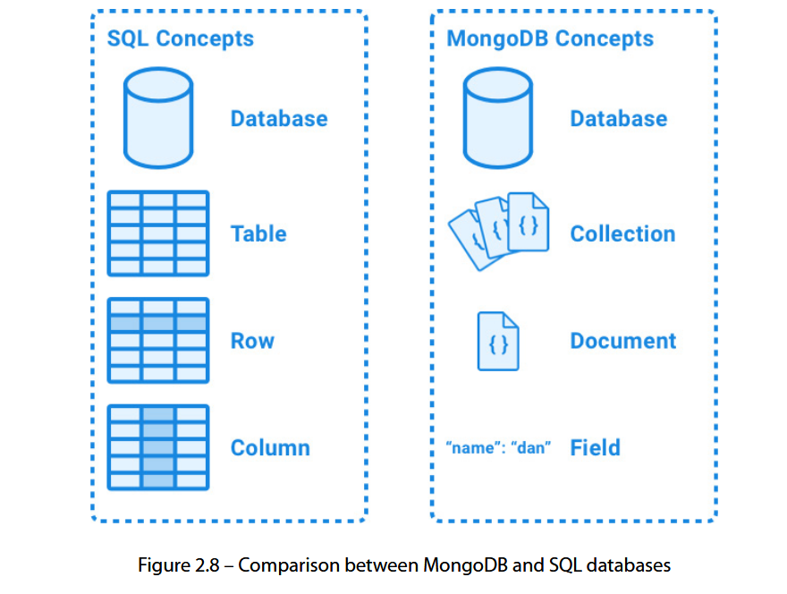

# Chapter 2 : Getting to Know Node.js and MongoDB

## Writing and running scripts with Node.js

### Concurrency with JavaScript in the browser and Node.js

### 1. Đặc điểm chính

- **`JavaScript`** là **event-driven** và **asynchronous by default** với nhiều API.
- Trình duyệt: code chạy khi có event (vd: `onclick`).
- `Node.js`: I/O như đọc/ghi file, request mạng xử lý async → nhiều request cùng lúc mà không cần quản lý thread thủ công.

---

### 2. Cơ chế Node.js

- **`libuv`** quản lý thread cho I/O nhưng lập trình viên vẫn làm việc trên **single runtime thread**.
- Không phải mỗi request là một thread mới → threads được tạo khi cần, giảm block I/O.
- Khác với server **multi-threaded**: Node.js ít bị block I/O hơn, nhưng lập trình viên cần tránh **synchronous functions** vì sẽ chặn event loop.

---

### 3. Event Loop & Task Queue

- **Synchronous code**: thực thi ngay trên call stack.
- **Asynchronous code**: đưa vào task queue kèm callback, chờ stack trống → event loop lấy ra chạy.
- Ví dụ: `setTimeout` dù `0ms` vẫn chạy **sau** code đồng bộ, vì callback chỉ được thực thi khi stack rỗng.

---

### 4. Ví dụ output thứ tự

```js
console.log('first')
setTimeout(() => console.log('second'), 0)
console.log('third')
// Output: first, third, second
```

> Vì callback của `setTimeout` luôn đợi stack trống mới chạy.

---

### 5. Công cụ học trực quan

- **Loupe tool**: [latentflip.com/loupe](http://latentflip.com/loupe/) mô phỏng **Call Stack**, **Web APIs**, **Event Loop**, **Task Queue**.



### Creating our first web server

1. **Tạo file mới** `backend/simpleweb.js`.
2. Import hàm `createServer` từ module `node:http`:

   ```js
   import { createServer } from 'node:http'
   ```

3. Tạo server với callback `(req, res) => { ... }`:

   ```js
   const server = createServer((req, res) => {
     res.statusCode = 200
     res.setHeader('Content-Type', 'text/plain')
     res.end('Hello HTTP world!')
   })
   ```

4. **Thiết lập host và port**:

   ```js
   const host = 'localhost'
   const port = 3000
   ```

5. **Lắng nghe kết nối**:

   ```js
   server.listen(port, host, () => {
     console.log(`Server listening on http://${host}:${port}`)
   })
   ```

6. **Chạy server**:

   ```bash
   node backend/simpleweb.js
   ```

7. Mở **[http://localhost:3000](http://localhost:3000)** trên trình duyệt → thấy `"Hello HTTP world!"`.

### Extending the web server to serve our JSON file

1. **Sao chép file** `backend/simpleweb.js` → `backend/webfiles.js`.
2. Import hàm đọc file:

   ```js
   import { readFileSync } from 'node:fs'
   ```

3. Đổi header `Content-Type` thành JSON:

   ```js
   res.setHeader('Content-Type', 'application/json')
   ```

4. Trả về nội dung file `users.json`:

   ```js
   res.end(readFileSync('backend/users.json'))
   ```

5. Dừng server cũ (`Ctrl + C`) để tránh trùng port.
6. Chạy server mới:

   ```bash
   node backend/webfiles.js
   ```

7. Mở **[http://localhost:3000](http://localhost:3000)** → thấy dữ liệu JSON từ file.

   - Thay đổi `users.json` → refresh trình duyệt sẽ thấy nội dung cập nhật.

# Introducing Docker, a platform for containers

## 1. Docker là gì?

- Nền tảng để **đóng gói, quản lý và chạy ứng dụng** trong môi trường **container**.
- Container: nhẹ, độc lập, chứa đủ dependencies để chạy app.
- Giúp tránh xung đột môi trường, đồng bộ setup giữa các thành viên team, dễ triển khai lên cloud & CI/CD.

---

## 2. Thành phần chính của Docker

- **Docker Client**: Chạy lệnh, gửi yêu cầu đến Docker daemon (local hoặc remote).
- **Docker Host**: Chứa Docker daemon, images, containers.
- **Docker Registry**: Lưu trữ images (mặc định là Docker Hub).



---

## 3. Image & Container

- **Image**: Template read-only (vd: `mongo` dựa trên `ubuntu`).
- **Container**: Instance của image, có thể cấu hình port, volume, network.
- Mặc định container bị cô lập → cần cấu hình để host truy cập port hoặc storage.

---

## 4. Cài đặt Docker

- Dùng **Docker Desktop** (Windows/Mac/Linux) → tải từ [docker.com](https://www.docker.com/products/docker-desktop/).
- Sau khi cài, kiểm tra:

  ```bash
  docker -v
  ```

  → hiển thị version là OK.

---

## 5. Tạo container đầu tiên

```bash
docker run -i -t ubuntu:24.04 /bin/bash
```

- **`:24.04`** là tag → chỉ định version.
- `-i` giữ STDIN mở, `-t` tạo pseudo-tty để tương tác.
- Trong shell container, kiểm tra OS:

  ```bash
  uname -a
  ```

- Thoát container:

  ```bash
  exit
  ```

---

## 6. Quy trình `docker run`

1. Pull image nếu chưa có (`docker pull ubuntu`).
2. Tạo container (`docker container create`).
3. Tạo filesystem RW, network interface.
4. Start container & chạy lệnh `/bin/bash`.
5. Gắn container shell vào terminal của bạn.

---

## 7. Dùng Docker trong VS Code

- Mở **Docker** extension (icon ở sidebar).
- Xem danh sách containers/images, start/stop/restart/remove.
- Xem logs hoặc attach shell trực tiếp vào container.

# Introducing MongoDB, a document database

---

## 1. Giới thiệu MongoDB

- **NoSQL** phổ biến nhất hiện tại, thuộc loại **Document Database**.
- Dữ liệu lưu dưới dạng **document** (JSON/BSON) → linh hoạt hơn SQL, không bắt buộc schema cố định.
- Các loại NoSQL khác:

  - Key-value (Redis)
  - Column-oriented (Amazon Redshift)
  - Graph-based (Neo4j)
  - Document-based (MongoDB)





---

## 2. Chạy MongoDB bằng Docker

1. Kiểm tra Docker hoạt động:

   ```bash
   docker ps
   ```

2. Chạy MongoDB container:

   ```bash
   docker run -d --name dbserver -p 27017:27017 --restart unless-stopped mongo:6.0.4
   ```

   - `-d`: chạy background
   - `--name`: tên container
   - `-p`: map port container ↔ host
   - `--restart unless-stopped`: auto start khi Docker chạy

3. Cài **MongoDB Shell** (`mongosh`) trên máy host.
4. Kết nối DB:

   ```bash
   mongosh mongodb://localhost:27017/ch2
   ```

---

## 3. CRUD với MongoDB Shell

**Collection** = bảng trong SQL, chứa nhiều document (object JSON).

### Create

```js
db.users.insertOne({ username: 'dan', fullName: 'Daniel Bugl', age: 26 })
db.users.insertMany([
  { username: 'jane', fullName: 'Jane Doe', age: 32 },
  { username: 'john', fullName: 'John Doe', age: 30 },
])
```

### Read

```js
db.users.find() // tất cả
db.users.findOne({ username: 'jane' }) // 1 user
db.users.find({ age: { $gt: 30 } }) // tuổi > 30
db.users.find().sort({ age: 1 }) // sort tăng dần
```

> Khi tìm theo `_id` phải dùng `ObjectId('...')`.

### Update

```js
db.users.updateOne({ username: 'dan' }, { $set: { age: 27 } })
db.users.updateOne(
  { username: 'new' },
  { $set: { fullName: 'New User' } },
  { upsert: true },
)
```

- `$set`: cập nhật field
- `$unset`: xóa field
- `replaceOne`: thay toàn bộ document

### Delete

```js
db.users.deleteOne({ username: 'new' })
```

---

## 4. Truy cập MongoDB qua VS Code

- Cài extension MongoDB (icon hình lá cây).
- **Add Connection** → nhập:

  ```
  mongodb://localhost:27017/
  ```

- Xem databases, collections, documents trực tiếp.
- Có thể **edit document** ngay trong VS Code hoặc chạy query giống trong shell.

# Accessing the MongoDB database via Node.js

## 1. Cài driver MongoDB cho Node.js

```bash
npm install mongodb@6.3.0
```

---

## 2. Tạo file `backend/mongodbweb.js`

```js
import { createServer } from 'node:http'
import { MongoClient } from 'mongodb'

// Kết nối MongoDB
const url = 'mongodb://localhost:27017/'
const dbName = 'ch2'
const client = new MongoClient(url)

try {
  await client.connect()
  console.log('Successfully connected to database!')
} catch (err) {
  console.error('Error connecting to database:', err)
}

// Tạo server
const server = createServer(async (req, res) => {
  const db = client.db(dbName)
  const users = db.collection('users')

  const usersList = await users.find().toArray()

  res.statusCode = 200
  res.setHeader('Content-Type', 'application/json')
  res.end(JSON.stringify(usersList))
})

// Lắng nghe port
const host = 'localhost'
const port = 3000
server.listen(port, host, () => {
  console.log(`Server listening on http://${host}:${port}`)
})
```

---

## 3. Chạy server

```bash
node backend/mongodbweb.js
```

---

## 4. Kết quả

- Mở **[http://localhost:3000](http://localhost:3000)** → nhận danh sách `users` từ MongoDB dưới dạng JSON.
- API dùng `node:http` và `mongodb` ở mức **low-level**, nên code khá dài dòng.
- Ở chương tiếp theo sẽ học **Express** (để làm API nhanh hơn) + **Mongoose** (để quản lý schema & CRUD tiện hơn).
