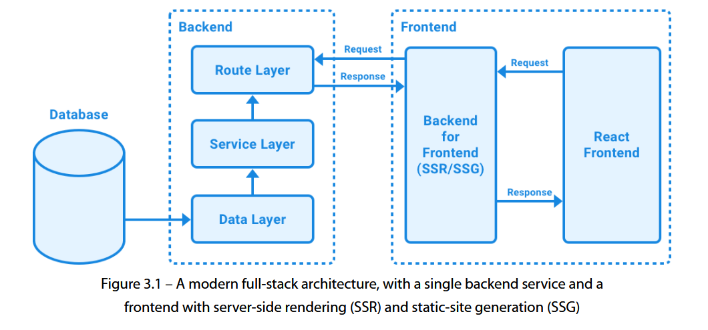
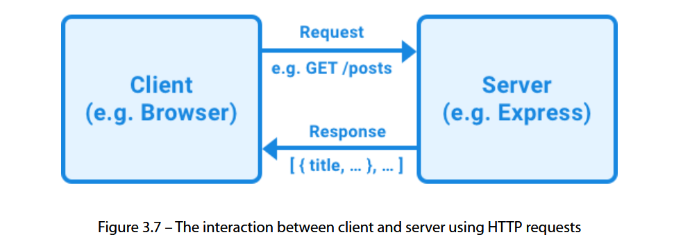

# Chapter 3 : Implementing a Backend Using Express, Mongoose ODM, and Jest

## Designing a backend service

**MVC** bao gồm các phần sau:

- **Model**: Xử lý dữ liệu và logic dữ liệu cơ bản
- **Controller**: Kiểm soát cách xử lý và hiển thị dữ liệu
- **View**: Hiển thị trạng thái hiện tại

Trong ứng dụng hiện đại, backend không còn đảm nhận việc render giao diện như mô hình MVC truyền thống nữa. Thay vào đó, frontend (có thể dùng SSR hoặc SSG) xử lý phần hiển thị, còn backend chỉ tập trung xử lý và cung cấp dữ liệu.

**Mô hình mới – Data–Service–Route pattern**

- **Route layer**: Định nghĩa các endpoint (routes), nhận request, xử lý input (params, body) rồi gọi hàm từ service layer.
- **Service layer**: Cung cấp các chức năng nghiệp vụ (CRUD, logic) và giao tiếp với data layer.
- **Data layer**: Truy cập cơ sở dữ liệu, thực hiện kiểm tra/validation cơ bản để đảm bảo tính nhất quán dữ liệu.

Cách tách lớp này giúp backend dễ bảo trì, tách biệt trách nhiệm rõ ràng, đặc biệt phù hợp cho dịch vụ chỉ cung cấp API, không xử lý UI.

## Providing a REST API using Express

Sau khi có **data layer** và **service layer**, chúng ta cần một **giao diện** để người dùng (client) truy cập backend — đó là **REST API**. REST API cho phép truy cập server qua HTTP request, dùng để giao tiếp giữa frontend và backend.

**Các phương thức HTTP chính trong REST**

- **GET**: Lấy dữ liệu (read), không thay đổi DB (idempotent). Trả về dữ liệu + `200 OK`.
- **POST**: Tạo mới resource, dựa trên dữ liệu trong request body. Trả về object mới + `201 Created` hoặc URL tới resource mới.
- **PUT**: Cập nhật toàn bộ resource (hoặc tạo mới với ID do client cung cấp). Trả về `200 OK` (có data), `204 No Content` (không trả data), hoặc `201 Created` (nếu tạo mới).
- **PATCH**: Cập nhật một phần resource (chỉ field được gửi). Trả về `200 OK` hoặc `204 No Content`.
- **DELETE**: Xoá resource. Trả về `200 OK` (có data) hoặc `204 No Content`.

**Best practice**

- Tổ chức route theo dạng thư mục.
- Dùng prefix `/api/v1/` để versioning API (giúp chạy song song `/api/v1/` và `/api/v2/` khi nâng cấp).

